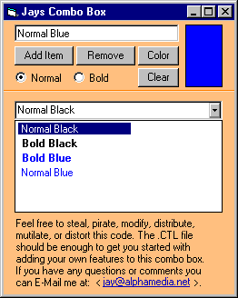



## Combobox \- Font Color / Font Bold Ability\!

### Description

This is a FULLY FUNCTIONAL Custom Control. I have

not loaded it with features for the purpose of letting

you download it and add to it yourselves! The code

Included Allows RemoveItem, Clear, Listcount,

Item(X), and AddItem(Text, Bold, Color)
 
### More Info
 

             |
---                |---
**Submitted On**   |2000-07-27 15:46:30
**By**             |[Sparq](https://github.com/Planet-Source-Code/PSCIndex/blob/master/ByAuthor/sparq.md)
**Level**          |Intermediate
**User Rating**    |4.8 (24 globes from 5 users)
**Compatibility**  |VB 6\.0
**Category**       |[Custom Controls/ Forms/  Menus](https://github.com/Planet-Source-Code/PSCIndex/blob/master/ByCategory/custom-controls-forms-menus__1-4.md)
**World**          |[Visual Basic](https://github.com/Planet-Source-Code/PSCIndex/blob/master/ByWorld/visual-basic.md)
**Archive File**   |[CODE\_UPLOAD82507272000\.zip](https://github.com/Planet-Source-Code/sparq-combobox-font-color-font-bold-ability__1-10139/archive/master.zip)

